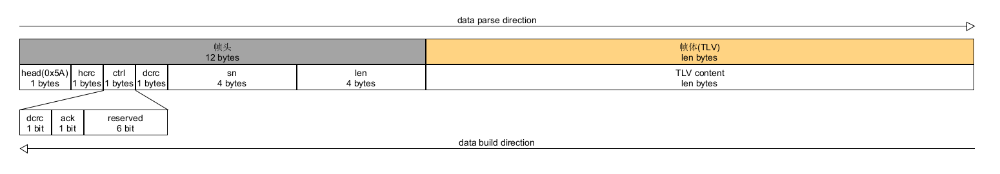
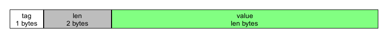

# comm

## 前言
---
本项目为一个轻量级点对点可靠串行通信协议，依赖于list库与fifo库，可在本人github中找到源码，本协议属于运输层协议采取类似TCP协议，协议所占内存小，执行效率高可用在嵌入式设备当中，移植方便无需依赖外部库。具有超时重传机制，校验失败重传机制，可达到至少送达一次效果。协议使用内存可配置。

## 通信结构
---
协议通信结构为帧头 + 帧体的形式



通信的基础数据单元为TLV（tag +len + value）简而言之就是标签 + 长度 + 数据的形式，所以用户发送的最基础的数据单元为一个tlv，协议接收的基础数据单元也是tlv，在接收到已经注册了回调函数的tlv时协议将自动跳转到目标tag的回调函数执行。

## 通信流程
---
### 发送方：
    当发送队列中有待发送消息时，协议将从队列中取出最先存入队列中的消息，将其通过硬件接口发送。此时发送进入等待状态，当收到对方响应帧时判断对方ACK帧sn码是否为当前消息sn码，判断ACK帧错误码是否接收成功，若为crc校验错误则立即重发当前数据帧，若成功或接收超时则舍弃当前数据帧，若超出发送超时等待时间则自动重发数据帧

### 接收方：
    当接收缓存区中数据长度大于帧头长度时读取消息头，验证消息头和头crc是否正确若正确则继续读取消息体，若错误直接舍弃该消息，当消息体接收完成后将判断数据crc是否正确若正确则向对方发送成功响应帧，所错误则向对方发送crc错误响应帧并删除该消息等待对方重发。

## 使用方法
---

### 1.加入工程
    将comm.c comm.h list.c ist.h fifo.c fifo.h 添加到目标工程当中
### 2.配置协议节拍输入
    周期调用 “comm_tick” 函数输入ms节拍数，推荐设置1ms定时中断周期输入1节拍
### 3.重写comm_putBuf
    comm_putBuf为虚函数用户可在任意包含comm.h的c文件中重写该函数，协议将自动调用用户重写的comm_putBuf函数（切记不可加__WEAK修饰）
    该函数为协议数据流输出函数，用户需将在函数中实现数据发送，若数据发送成功则返回COMM_ERR_SUCCESS，否则返回COMM_ERR_UNKNOW即可
### 4.配置协议数据输入
    用户需将调用comm_getByte或comm_getBuf函数向协议输入数据，如使用串口通信则在串口接收中断中调用comm_getByte函数输入数据即可
### 5.注册回调函数
    用户需要向协议注册回调函数，当协议收到目标标签数据后自动执行回调函数，切记回调函数TAG必须时系统唯一的，协议保留0-3的TAG为系统TAG用户可使用4-255，用户注册的回调函数不可执行时间过长，否则将导致协议运行阻塞
### 5.启动协议
    将协议各个接口配置好后方可启动运行协议，调用comm_start函数启动协议，需判断函数返回值是否启动成功。
### 6.协议处理
    用户需周期调用comm_handle函数来保证协议运行该函数为协议处理函数，当用户发送数据时并非直接调用硬件接口发送，而是先存到发送数据队列中等待comm_handle函数执行时发送，处理函数执行频率无需过高和通信信道数据量匹配即可用户自行决定comm_handle调用频率。
### 7.发送数据
    用户调用comm_send函数输入数据tlv协议将自行吧数据至少发送到对方一次

## 协议配置
---
用户可在comm.h中进行协议参数、空间配置

```C
/****************************************************************************************/
/*                                  用户配置部分                                         */
/****************************************************************************************/

/* 内存空间相关接口 */
#define COMM_MALLOC                 malloc  // 空间申请接口
#define COMM_FREE                   free    // 空间释放接口

/* 协议空间大小配置 */
#define COMM_TXFIFO_SIZE            5       // 发送队列大小 （单位：消息数）
#define COMM_RXBYTEFIFO_SIZE        256     // 接收字节缓冲区大小 （单位：字节）

/* 超时时间配置 */
#define COMM_TX_TIMEOUT             100     // 发送超时时间 （单位：ms）
#define COMM_RX_TIMEOUT             100     // 接收超时时间 （单位：ms）

/* 最大发送次数 */
#define COMM_TX_REPEAT              5       // 最大发送次数

/****************************************************************************************/
```
> 修改`COMM_MALLOC`、`COMM_FREE`接口来进行对协议所申请内存空间的方法进行修改

> `COMM_TXFIFO_SIZE`为协议消息队列长度，最多可以存几条待发送消息

> `COMM_RXBYTEFIFO_SIZE`为接收缓存区，若单条消息数据连续发送（如uart）建议接收缓存区大于最大消息长度

> `COMM_TX_TIMEOUT`为发送超时时间，若超过此时间未收到响应帧，则自动重发

> `COMM_RX_TIMEOUT`为接收超时时间，若接收到数据头，超过此时间未接收完成数据帧，则自动丢弃所接收数据

> `COMM_TX_REPEAT`为最大发送次数，若接收方crc错误或接收超时协议将自动重发，若超出最大发送次数则自动丢弃该数据帧

## 相关函数
---
```C
/**
 * @brief 启动串行通信协议
 * 
 * @return comm_err 错误码
 */
comm_err comm_start(void)
```
> 启动通信协议函数

> 参数：无

> 返回值：错误码

| 错误码 | 数值 | 备注 |
| ---- | ---- | ---- |
| COMM_ERR_SUCCESS  | 0 | 成功 |
| COMM_ERR_NOTSPACE  | 1 | 空间不足 |
| COMM_ERR_REPEAT  | 2 | 重复启动 |

---

```C
/**
 * @brief 发送数据
 * 
 * @param tlv 数据tlv
 * @return comm_err 
 */
comm_err comm_send(comm_tlv_t tlv)
```
> 发送数据函数

> 参数：tlv 数据tlv

> 返回值：错误码

| 错误码 | 数值 | 备注 |
| ---- | ---- | ---- |
| COMM_ERR_SUCCESS  | 0 | 成功 |
| COMM_ERR_NOTSPACE  | 1 | 空间不足 |
| COMM_ERR_NOTSTART  | 4 | 协议未启动 |
| COMM_ERR_UNKNOW  | -1 | 未知错误 |

---

```C
/**
 * @brief 协议运行处理
 * 
 */
void comm_handle(void)
```
> 协议运行处理函数

> 参数：无

> 返回值：无

---

```C
/**
 * @brief 协议字节流输出
 * 
 * @param buf 数据地址
 * @param len 数据长度
 */
comm_err comm_putBuf(comm_uint8* buf, comm_uint32 len)
```
> 协议字节流输出函数

> 参数：buf 数据地址 len 数据长度

> 返回值：错误码

| 错误码 | 数值 | 备注 |
| ---- | ---- | ---- |
| COMM_ERR_SUCCESS  | 0 | 成功 |
| COMM_ERR_UNKNOW  | -1 | 未知错误 |

---

```C
/**
 * @brief 协议字节输入
 * 
 * @return comm_err 错误码
 */
comm_err comm_getByte(comm_uint8 byte)
```
> 协议字节输入函数

> 参数：byte 数据

> 返回值：错误码

| 错误码 | 数值 | 备注 |
| ---- | ---- | ---- |
| COMM_ERR_SUCCESS  | 0 | 成功 |
| COMM_ERR_NOTSTART  | 4 | 协议未启动 |
| COMM_ERR_FIFOFULL  | 5 | 缓冲区已满 |
| COMM_ERR_UNKNOW  | -1 | 未知错误 |

---

```C
/**
 * @brief 协议字节流输入
 * 
 * @param buf 字节流地址
 * @param len 字节流长度
 * @return comm_err 错误码
 */
comm_err comm_getBuf(comm_uint8* buf, comm_uint32 len)
```
> 协议字节流输入函数

> 参数：buf 数据地址 len 数据长度

> 返回值：错误码

| 错误码 | 数值 | 备注 |
| ---- | ---- | ---- |
| COMM_ERR_SUCCESS  | 0 | 成功 |
| COMM_ERR_NOTSTART  | 4 | 协议未启动 |
| COMM_ERR_FIFOFULL  | 5 | 缓冲区已满 |
| COMM_ERR_UNKNOW  | -1 | 未知错误 |

---

```C
/**
 * @brief 协议心跳输入
 * 
 * @param time 心跳时间 （单位：ms）
 * @return comm_err 错误码
 */
comm_err comm_tick(comm_uint32 time)
```
> 协议心跳输入函数

> 参数：time 节拍数

> 返回值：错误码

| 错误码 | 数值 | 备注 |
| ---- | ---- | ---- |
| COMM_ERR_SUCCESS  | 0 | 成功 |
| COMM_ERR_NOTSTART  | 4 | 协议未启动 |

---

```C
/**
 * @brief 注册回调函数
 * 
 * @param tag 数据标签
 * @param callback 回调函数
 * @return comm_err 错误码
 */
comm_err comm_register(comm_uint8 tag, void (*callback)(comm_uint16 len, comm_uint8* value))
```
> 注册回调函数函数

> 参数：tag 数据标签 callback 回调函数

> 返回值：错误码

| 错误码 | 数值 | 备注 |
| ---- | ---- | ---- |
| COMM_ERR_SUCCESS  | 0 | 成功 |
| COMM_ERR_REPEAT  | 2 | 数据标签已存在 |
| COMM_ERR_NOTSTART  | 4 | 协议未启动 |
| COMM_ERR_FIFOFULL  | 5 | 缓冲区已满 |
| COMM_ERR_UNKNOW  | -1 | 未知错误 |

---